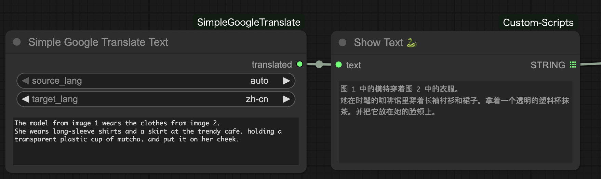

<h1>SimpleGoogleTranslate for ComfyUI</h1>

A minimal and easy-to-use Google Translate text node for ComfyUI. This extension provides a simple interface to translate text directly inside your workflow using Google Translate.

🌟 Features
<ul> <li><strong>Lightweight & Simple</strong>: Only one node — clean and easy to use.</li> <li><strong>Google Translate API (unofficial)</strong>: Uses the <code>googletrans</code> library.</li> <li><strong>Automatic Language Detection</strong>: Set <code>source_lang</code> to <code>auto</code>.</li> <li><strong>Full Language List Support</strong>: All languages supported by <code>googletrans.LANGUAGES</code>.</li> <li><strong>Multiline Input</strong>: Ideal for prompts, captions, or large text blocks.</li> </ul>
🧩 Node Overview
Simple Google Translate Text
<ul> <li><strong>Inputs</strong>: <ul> <li><code>source_lang</code>: original language (or <code>auto</code>)</li> <li><code>target_lang</code>: translation output language</li> <li><code>text</code>: content to translate</li> </ul> </li> <li><strong>Outputs</strong>: <ul> <li><code>translated</code> (STRING): translated text</li> </ul> </li> </ul>
📦 Installation
<ol> <li> 
Clone or copy this folder into your ComfyUI <code>custom_nodes</code> directory:
 <pre><code>cd ComfyUI/custom_nodes git clone https://github.com/yourname/ComfyUI-SimpleGoogleTranslate.git</code></pre> </li> <li> 
Or manually create the folder:
 <pre><code>ComfyUI/custom_nodes/ComfyUI_SimpleGoogleTranslate/</code></pre> </li> <li> 
Restart ComfyUI
 </li> </ol>
📚 Requirements
<ul> <li><code>googletrans==4.0.0-rc1</code></li> </ul> 
This package will auto-install when ComfyUI loads the extension, as long as your folder contains:

requirements.txt

📁 File Structure
ComfyUI_SimpleGoogleTranslate/
│
├── __init__.py
├── simple_google_translate.py
└── requirements.txt

📝 Example Workflow

⚠️ Notes
<ul> <li>This extension uses <code>googletrans</code>, an unofficial Google Translate API.</li> <li>If translation stops working, Google may have updated their service.</li> <li>For production use, consider official APIs such as DeepL or Google Cloud Translate.</li> </ul>
📄 License

Free to use, modify, and integrate into your own projects. Attribution is not required but appreciated. 🙂

