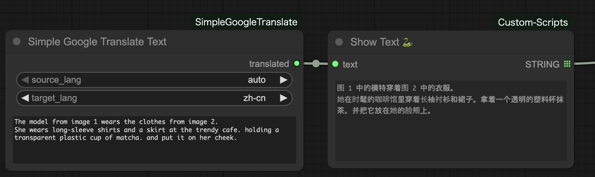

# SimpleGoogleTranslate for ComfyUI

A minimal and easy-to-use Google Translate text node for ComfyUI. This extension provides a simple interface to translate text directly inside your workflow using Google Translate.

## 🌟 Features

- **Lightweight & Simple**: Only one node — clean and easy to use.
- **Google Translate (unofficial)**: Uses the [`deep-translator`](https://github.com/nidhaloff/deep-translator) library's `GoogleTranslator` backend.
- **Automatic Language Detection**: Set `source_lang` to `auto`.
- **Full Language List Support**: All languages supported by `deep_translator.GoogleTranslator`.
- **Multiline Input**: Ideal for prompts, captions, or large text blocks.

## 🧩 Node Overview

### Simple Google Translate Text

- **Inputs**:
  - `source_lang`: original language (or `auto`)
  - `target_lang`: translation output language
  - `text`: content to translate
- **Outputs**:
  - `translated` (STRING): translated text

## 📦 Installation

1. Clone or copy this folder into your ComfyUI `custom_nodes` directory:

   ```bash
   cd ComfyUI/custom_nodes
   git clone https://github.com/KAVVATARE/ComfyUI-SimpleGoogleTranslate.git
   ```

2. Or manually create the folder:

   ```
   ComfyUI/custom_nodes/ComfyUI_SimpleGoogleTranslate/
   ```

3. Restart ComfyUI

## 📚 Requirements

- `deep-translator>=1.11.4`

This package will auto-install when ComfyUI loads the extension, as long as your folder contains:

```
requirements.txt
```

## 📁 File Structure

```
ComfyUI_SimpleGoogleTranslate/
│
├── __init__.py
├── simple_google_translate.py
└── requirements.txt
```

## 📝 Example Workflow



## ⚠️ Notes

- This extension uses `deep-translator`'s Google Translate backend, an unofficial Google Translate interface.
- If translation stops working, Google may have updated their service.
- For production use, consider official APIs such as DeepL or Google Cloud Translate.

## 📄 License

Free to use, modify, and integrate into your own projects. Attribution is not required but appreciated. 🙂
